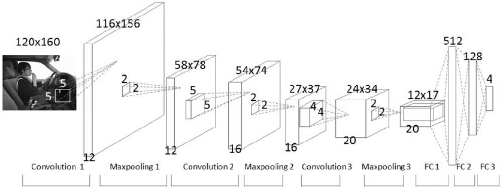
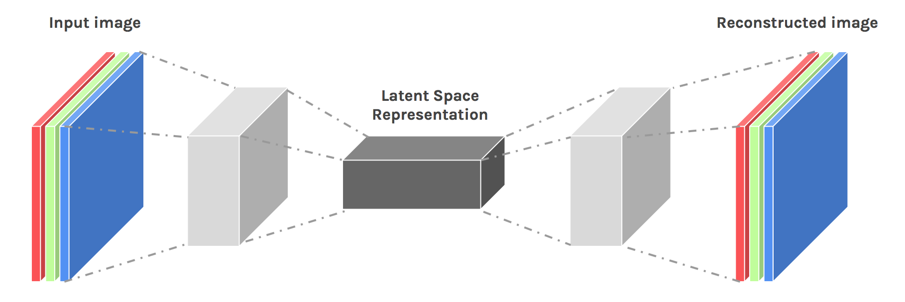

# Age-Detection-of-Indian-Actors

This code can detect your eyes and alert when the user is drowsy.

# Applications
This can be used in mobile devices, scanners to detect ages, can be a fun app.

# Code Requirements
The example code is in Python (version 2.7 or higher will work).

# Dependencies
import cv2
import pandas, numpy
import keras
import sklearn

# Description
A computer vision system that can automatically detect age categories in an image, that is trained on 19k+ images.

# Algorithm
Each image is standardized with size 32x32x3 and trained on CNN coupled with a feed forward neural network for classification.

# Execution
Run the predictions.ipynb code by following the steps as mentioned in the code.

# Test Predictions
Accuracy = 78.1%

# Further Improvements
1. Changing the architecture and hyper parameters to finetune the training would improve accuracies.
2. Images can be denoised and then can be given to training. like,
# 

Paper: https://arxiv.org/pdf/1606.08921.pdf
3. 
